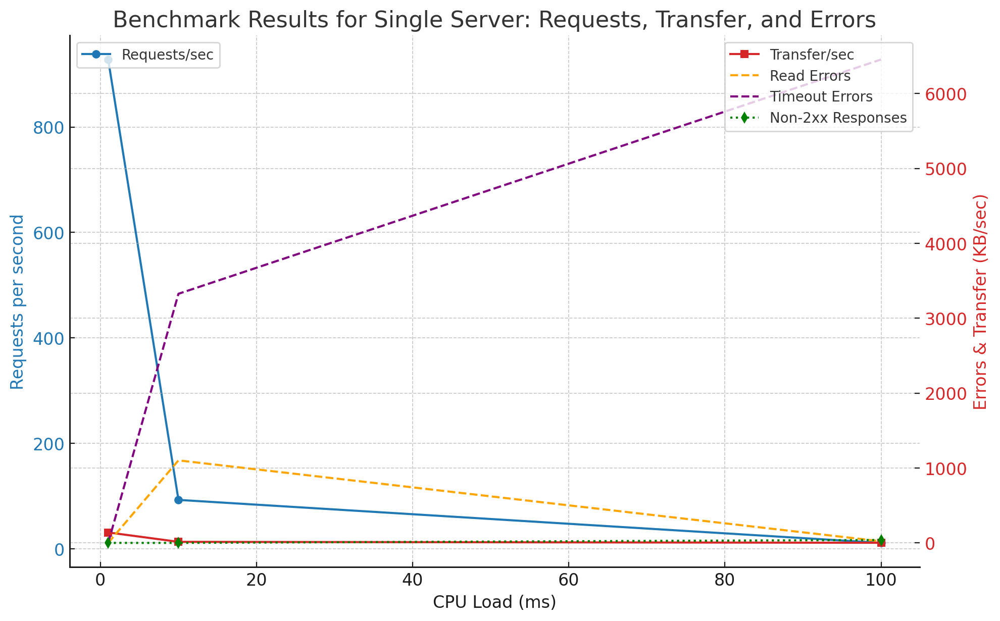
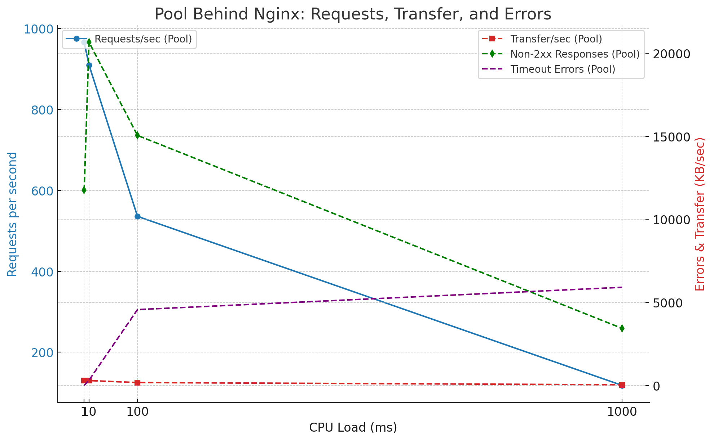
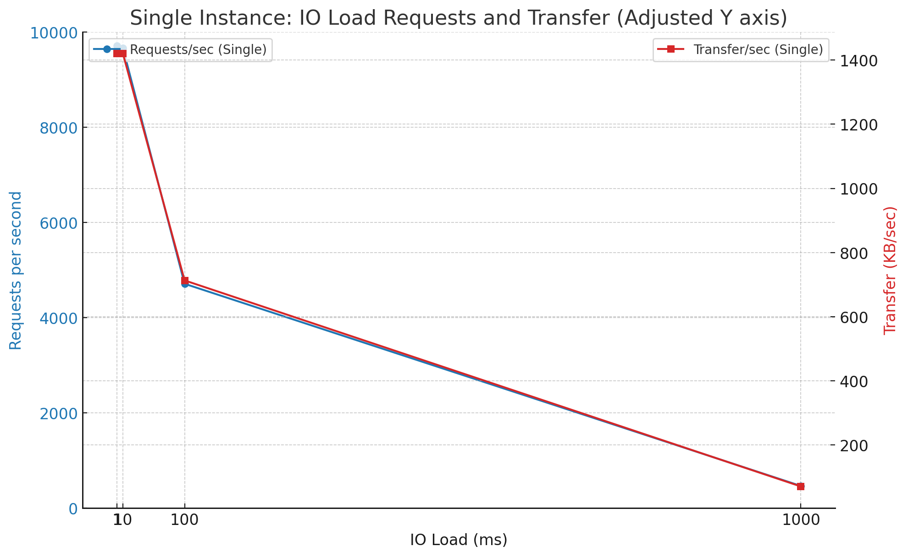
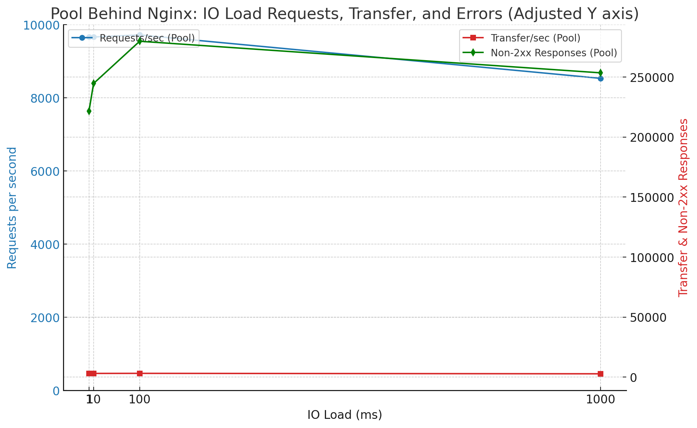

# Rust Web App Benchmarking Project

This project contains a simple Rust web application designed to simulate CPU-bound and IO-bound workloads through REST endpoints. The application is benchmarked using *wrk2* and tested under different loads with a single instance and a pool of instances behind *Nginx*. The results are analyzed using various performance metrics such as **requests per second (RPS)**, **transfer rate**, and **error rates**.

## Table of Contents
Project Overview
Prerequisites
Installation
Usage
Endpoints
Benchmarking
Nginx Configuration
Running the Tests
Results
End Results
Contributing
License

## Project Overview

This Rust web app exposes two endpoints that simulate:

* CPU-bound tasks: Simulating CPU load by performing heavy computation.
* IO-bound tasks: Simulating IO load by introducing timed delays (sleep).

The project aims to evaluate and benchmark the performance of the Rust web server under various load scenarios and configurations using wrk2 for load testing.

## Prerequisites

* Rust: Install Rust
* wrk2: Install wrk2
* Nginx: Install Nginx

For Rust:

Ensure you have Rust installed:

```bash
curl --proto '=https' --tlsv1.2 -sSf https://sh.rustup.rs | sh
```

## Installation

Clone the repository:

```bash
git clone https://github.com/your_username/redesigned-fishstick.git
cd redesigned-fishstick
```

Build the Rust application: You can build the release version of the app to generate a binary:

```bash
cargo build --release
```

The binary will be located in target/release/.

## Usage
You can run the app using the binary, passing the port via environment variables.

### Running the Server
```bash
PORT=8080 ./target/release/benchmarking_app
```

By default, the server listens on 127.0.0.1:8080. To modify the port, adjust the PORT environment variable.

### Endpoints

The application exposes the following endpoints:

CPU-bound load:

```bash
GET /cpu_load/{duration}
```

duration: Time in milliseconds to run the CPU-bound task.
Example: /cpu_load/100

IO-bound load:

```bash
GET /io_load/{duration}
```

duration: Time in milliseconds to simulate IO by sleeping.
Example: /io_load/100

## Benchmarking

### wrk2

Use wrk2 to load test the application. For example, to test the CPU load with 5 threads, 500 connections, and a request rate of 1000 requests per second:

```bash
wrk -L -t5 -c500 -d30s -R1000 http://localhost:8080/cpu_load/100
```

This sends requests to the `/cpu_load/100` endpoint for `30` seconds with `1000` requests per second.

### Nginx Configuration

To test the performance of a pool of instances behind Nginx, you can set up a load balancer using the following configuration:

Install Nginx:

```bash
sudo apt-get install nginx
```

Configure Nginx to balance between multiple instances:

```
/etc/nginx/nginx.conf:

nginx
upstream backend_pool {
server 127.0.0.1:8080;
server 127.0.0.1:8081;
server 127.0.0.1:8082;
server 127.0.0.1:8083;
keepalive 64;
}

server {
listen 80;
location / {
proxy_pass http://backend_pool;
proxy_http_version 1.1;
proxy_set_header Connection "";
proxy_set_header Host $host;
}
}
```

Reload Nginx:

```bash
sudo nginx -s reload
```

Start multiple instances of the app on different ports (e.g., 8080, 8081, 8082, etc.).

### Running the Tests

You can run the load tests for different scenarios by adjusting the load duration and number of instances. Below are some common test scenarios:

Single Instance (CPU Load)
```bash
wrk -L -t5 -c500 -d30s -R10000 http://localhost:8080/cpu_load/100
```
Pool of Instances (IO Load)
```bash
wrk -L -t5 -c500 -d30s -R10000 http://localhost/io_load/100
```
### Results

The results are collected from the wrk2 tests and analyzed using metrics like:

```
Requests per second (RPS)
Transfer rate (KB/sec)
Non-2xx or 3xx responses
Socket errors
```

### End Results

Here are the final benchmark results for the CPU-bound and IO-bound tests across a single server and a pool of instances behind Nginx:

CPU Load Results
Single Server:


Pool Behind Nginx:


IO Load Results
Single Server:


Pool Behind Nginx:


These plots summarize the key performance metrics across different load conditions.

# Contributing

Contributions are welcome! Please follow these steps:

Fork the repository.

Create a new branch: `git checkout -b feature/your-feature`.

Commit your changes: `git commit -m 'Add some feature'`.

Push to the branch: `git push origin feature/your-feature`.

Open a pull request.

# License

See the LICENSE file for details.
